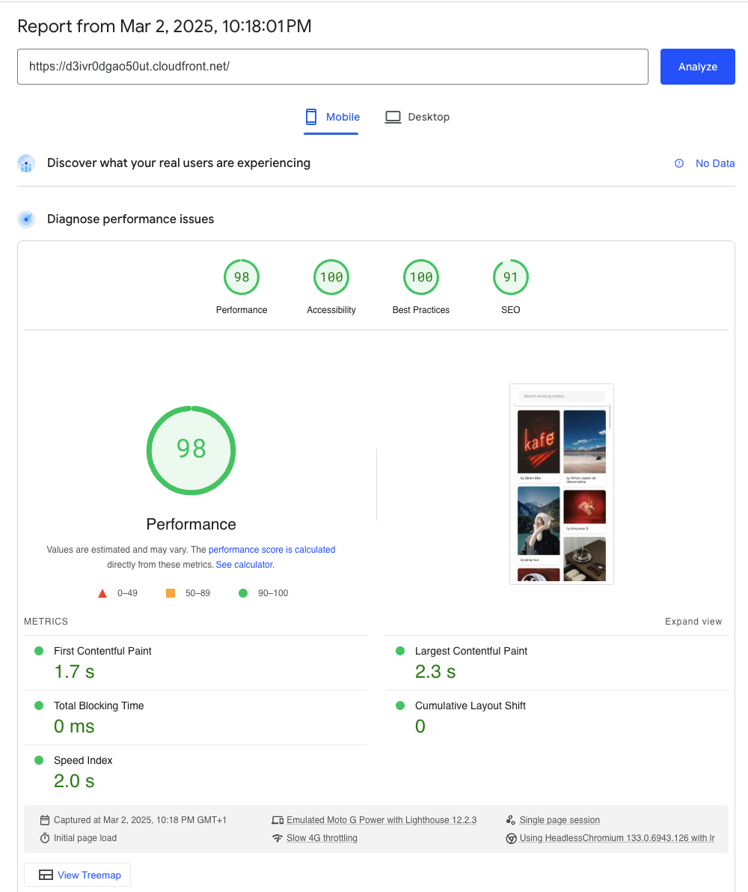
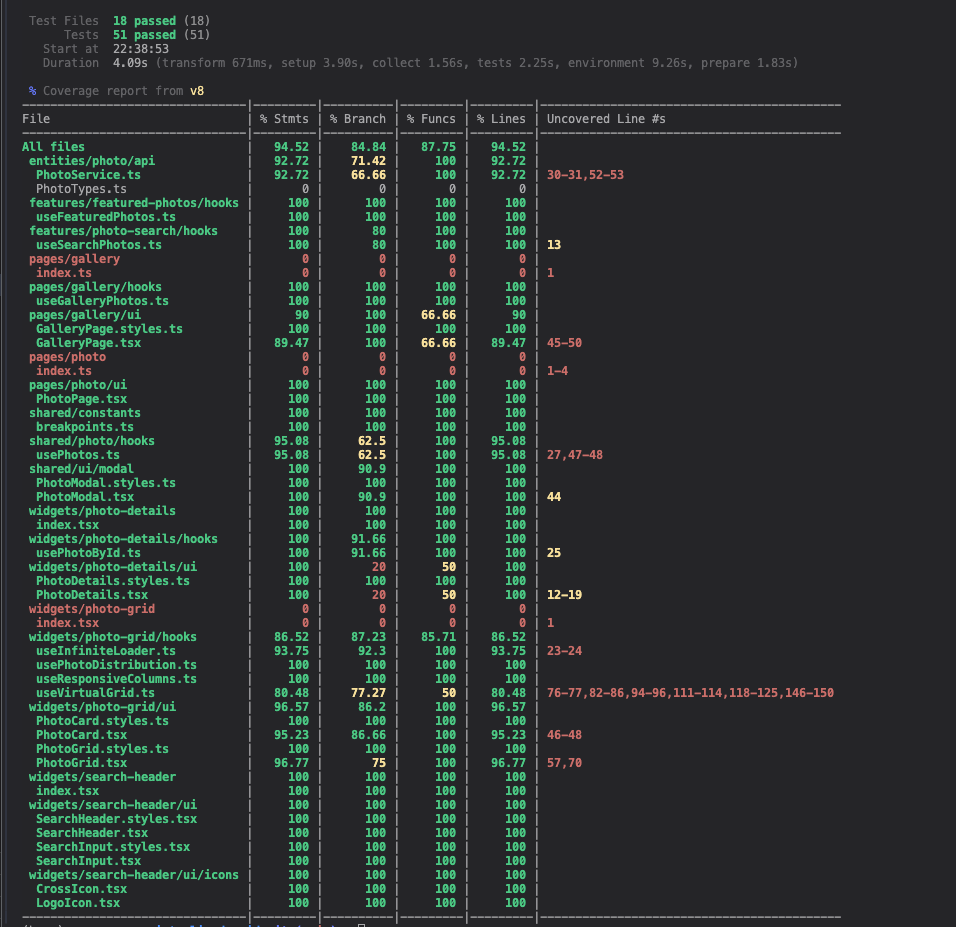

# Photo Gallery

URL: https://d3ivr0dgao50ut.cloudfront.net/

Google Page Speed: https://pagespeed.web.dev/analysis/https-d3ivr0dgao50ut-cloudfront-net/umrhn2yub2?form_factor=mobile

## AWS Deployment

The application is deployed using AWS CDK with the following infrastructure:

- **S3 Bucket:** Hosts the static React application
- **CloudFront:** CDN for global content delivery and caching

## Screenshots




## CLI commands

```bash
npm install
```

## Running the app

```bash
npm run dev
```

## Running tests with coverage

```bash
npm run test:coverage
```

## Build

```bash
npm run build
```

## Deploying to AWS

Setup AWS credentials:

```bash
aws configure
```

Deploy the application:

```bash
npm run deploy
```

## Project Structure

This project uses a feature-sliced design approach to structuring the code.
https://feature-sliced.design/docs/get-started/overview

```bash
site/
├── src/
│   ├── features/
│   ├── pages/
│   ├── widgets/
│   ├── shared/
│   ├── entities/
│   ├── test/
│   ├── types/
│   ├── utils/
│   └── index.ts
```
